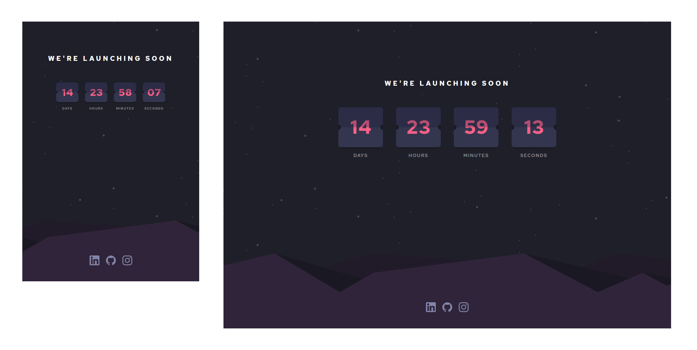

# Hola! 

Launch countdown es la solución a un desafío presentado por [Frontend Mentor. ](https://www.frontendmentor.io/challenges/launch-countdown-timer-N0XkGfyz-)
El proyecto está construido con React.js y  Vanilla CSS.

# Preview 

# Instalación

- Primero clona o descarga el repositorio en donde tu quieras. 
- Instala las dependencias con ``npm install`` 
- Corre el proyecto con ``npm start``